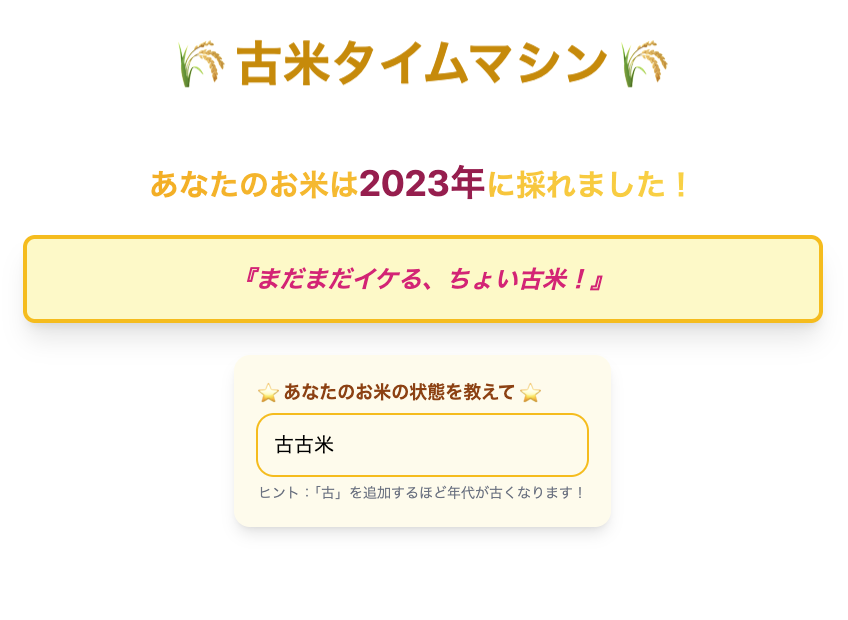

# 古米タイムマシン 🌾
お米の「古さ」で遊ぶ面白いウェブアプリ！「古」という文字を入力するたびに、あなたのお米はどんどん古くなります！😂

## 🍚 概要
「古米タイムマシン」は、入力された「古」の数に応じてお米の年代を計算し、ユーモアたっぷりのメッセージでその古米度を教えてくれます。「古古古古古米」と入力すれば、恐竜時代のお米かもしれません！

## ✨ 特徴
- 「古」の数でお米の年齢を自動計算
- 年代に合わせた面白いメッセージが表示
- かわいいアニメーションとデザイン
- 完全に無意味だけど、なぜか楽しい

## 🔧 技術スタック
- Vue 3 (Composition API)
- TypeScript
- Tailwind CSS

## 📝 使い方
テキストボックスに「古」を含む文字列を入力
自動的にお米の年代とメッセージが更新
笑って楽しむ

## 📸 スクリーンショット
